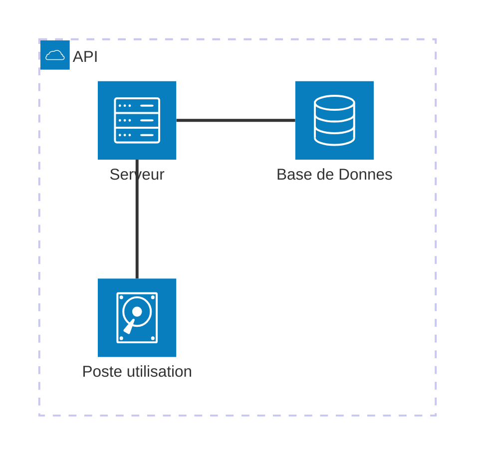

# Mini Projet
[](https://www.w3.org/)
[](https://www.php.net/)
## 📄Introduction


- <span style="color:Red">&copy;</span> L.T
- <span style="color:Orange">&reg;</span> BTS CIEL
- <span style="color:Blue">Version :</span> 1.0

## 📅Tables des matières

* <a href="#P1">📂Chemin d'accès</a>
* <a href="#P2">📊BDD</a>
* <a href="#P3">💡Info de connnexion</a>

## 📂 Chemin d'accès

📦 MiniProjet \
┣ 📗 readme.md \
┣ 📂 css \
┃ ┣ 📜 *[style.css](/css/style.css)* \
┃ ┣ 📂 js \
┃ ┃ ┣ 📜 *[qrcode.js](/js/qrcode.js)* \
┣ 📜 *[a2f.php](/a2f.php)* \
┣ 📜 *[data.php](/data.php)* \
┣ 📜 *[db.php](/db.php)* \
┣ 📜 *[index.php](/index.php)* \
┣ 📜 *[info.php](/info.php)* \
┣ 📜 *[login.php](/login.php)* \
┣ 📜 *[miniprojet.php](/miniprojet.sql)* \
┣ 📜 *[register.php](/register.php)* \
┣ 📜 *[screen.png](/screen.png)* 


## <span>📊BDD</span>

```sql
-- phpMyAdmin SQL Dump
-- version 5.2.1
-- https://www.phpmyadmin.net/
--
-- Hôte : 127.0.0.1
-- Généré le : jeu. 13 mars 2025 à 16:28
-- Version du serveur : 10.4.32-MariaDB
-- Version de PHP : 8.2.12

SET SQL_MODE = "NO_AUTO_VALUE_ON_ZERO";
START TRANSACTION;
SET time_zone = "+00:00";


/*!40101 SET @OLD_CHARACTER_SET_CLIENT=@@CHARACTER_SET_CLIENT */;
/*!40101 SET @OLD_CHARACTER_SET_RESULTS=@@CHARACTER_SET_RESULTS */;
/*!40101 SET @OLD_COLLATION_CONNECTION=@@COLLATION_CONNECTION */;
/*!40101 SET NAMES utf8mb4 */;

--
-- Base de données : `miniprojet`
--

-- --------------------------------------------------------

--
-- Structure de la table `auth_codes`
--

CREATE TABLE `auth_codes` (
  `id` int(11) NOT NULL,
  `user_id` int(11) NOT NULL,
  `code` varchar(6) NOT NULL,
  `created_at` datetime DEFAULT current_timestamp(),
  `expires_at` datetime NOT NULL,
  `used` tinyint(1) DEFAULT 0
) ENGINE=InnoDB DEFAULT CHARSET=utf8mb4 COLLATE=utf8mb4_general_ci;

--
-- Déchargement des données de la table `auth_codes`
--

INSERT INTO `auth_codes` (`id`, `user_id`, `code`, `created_at`, `expires_at`, `used`) VALUES
(1, 1, '784922', '2025-03-13 14:10:43', '2025-03-13 14:15:43', 0),
(2, 1, '490593', '2025-03-13 14:10:47', '2025-03-13 14:15:47', 0),
(3, 1, '521947', '2025-03-13 14:10:47', '2025-03-13 14:15:47', 1),
(4, 1, '371526', '2025-03-13 14:10:56', '2025-03-13 14:15:56', 0),
(5, 1, '425337', '2025-03-13 14:12:37', '2025-03-13 14:17:37', 1),
(6, 1, '017218', '2025-03-13 14:12:43', '2025-03-13 14:17:43', 0),
(7, 1, '789315', '2025-03-13 14:17:42', '2025-03-13 14:22:42', 0),
(8, 2, '025007', '2025-03-13 14:52:25', '2025-03-13 14:57:25', 0),
(9, 2, '558343', '2025-03-13 14:55:03', '2025-03-13 15:00:03', 0),
(10, 2, '676553', '2025-03-13 14:55:03', '2025-03-13 15:00:03', 0),
(11, 2, '438032', '2025-03-13 15:02:01', '2025-03-13 15:07:01', 1),
(12, 2, '116467', '2025-03-13 15:02:04', '2025-03-13 15:07:04', 0),
(13, 1, '551301', '2025-03-13 15:52:28', '2025-03-13 15:57:28', 1),
(14, 1, '964055', '2025-03-13 15:52:32', '2025-03-13 15:57:32', 0),
(15, 2, '944536', '2025-03-13 16:07:34', '2025-03-13 16:12:34', 1),
(16, 2, '124541', '2025-03-13 16:07:37', '2025-03-13 16:12:37', 0),
(17, 2, '175836', '2025-03-13 16:08:02', '2025-03-13 16:13:02', 0),
(18, 2, '136438', '2025-03-13 16:08:24', '2025-03-13 16:13:24', 1),
(19, 2, '068869', '2025-03-13 16:08:56', '2025-03-13 16:13:56', 0);

-- --------------------------------------------------------

--
-- Structure de la table `code`
--

CREATE TABLE `code` (
  `id` int(11) NOT NULL,
  `t` timestamp NOT NULL DEFAULT current_timestamp() ON UPDATE current_timestamp(),
  `x` float NOT NULL,
  `y` float NOT NULL,
  `z` float NOT NULL
) ENGINE=InnoDB DEFAULT CHARSET=utf8mb4 COLLATE=utf8mb4_general_ci;

--
-- Déchargement des données de la table `code`
--

INSERT INTO `code` (`id`, `t`, `x`, `y`, `z`) VALUES
(1, '2025-03-06 15:46:13', 0.1, 0.2, 0.3),
(2, '2025-03-06 15:49:23', 0.15, 0.18, 0.23),
(3, '2025-03-06 15:51:01', 0.19, 0.16, 0.25),
(4, '2025-03-06 15:52:56', 0.21, 0.12, 0.26),
(5, '2025-03-06 16:02:56', 0.25, 0.15, 0.27),
(6, '2025-03-06 16:05:56', 0.22, 0.17, 0.21),
(7, '2025-03-06 16:08:56', 0.2, 0.23, 0.2),
(8, '2025-03-06 16:12:56', 0.24, 0.14, 0.24),
(9, '2025-03-06 16:18:46', 0.25, 0.19, 0.26),
(10, '2025-03-06 16:21:56', 0.27, 0.24, 0.21);

-- --------------------------------------------------------

--
-- Structure de la table `users`
--

CREATE TABLE `users` (
  `id` int(11) NOT NULL,
  `email` varchar(255) NOT NULL,
  `password` varchar(255) NOT NULL,
  `totp_secret` varchar(16) DEFAULT NULL,
  `created_at` datetime DEFAULT current_timestamp()
) ENGINE=InnoDB DEFAULT CHARSET=utf8mb4 COLLATE=utf8mb4_general_ci;

--
-- Déchargement des données de la table `users`
--

INSERT INTO `users` (`id`, `email`, `password`, `totp_secret`, `created_at`) VALUES
(1, 'luc.tournie@carnus.fr', '$2y$10$IWntMQ7ChnBUHiT6/025Rep2BFaSQ1Q868v9NggNC1m5cmmI2zyO.', NULL, '2025-03-13 14:03:35'),
(2, 'luc.tourniem@gmail.com', '$2y$10$Vr9YWjnqvIil6ylI.br0F.HV5LNDCXH6N0qUlUc/B9ivYSH1DX1Oy', NULL, '2025-03-13 14:52:21');

--
-- Index pour les tables déchargées
--

--
-- Index pour la table `auth_codes`
--
ALTER TABLE `auth_codes`
  ADD PRIMARY KEY (`id`),
  ADD KEY `user_id` (`user_id`);

--
-- Index pour la table `code`
--
ALTER TABLE `code`
  ADD PRIMARY KEY (`id`);

--
-- Index pour la table `users`
--
ALTER TABLE `users`
  ADD PRIMARY KEY (`id`),
  ADD UNIQUE KEY `email` (`email`);

--
-- AUTO_INCREMENT pour les tables déchargées
--

--
-- AUTO_INCREMENT pour la table `auth_codes`
--
ALTER TABLE `auth_codes`
  MODIFY `id` int(11) NOT NULL AUTO_INCREMENT, AUTO_INCREMENT=20;

--
-- AUTO_INCREMENT pour la table `code`
--
ALTER TABLE `code`
  MODIFY `id` int(11) NOT NULL AUTO_INCREMENT, AUTO_INCREMENT=11;

--
-- AUTO_INCREMENT pour la table `users`
--
ALTER TABLE `users`
  MODIFY `id` int(11) NOT NULL AUTO_INCREMENT, AUTO_INCREMENT=3;

--
-- Contraintes pour les tables déchargées
--

--
-- Contraintes pour la table `auth_codes`
--
ALTER TABLE `auth_codes`
  ADD CONSTRAINT `auth_codes_ibfk_1` FOREIGN KEY (`user_id`) REFERENCES `users` (`id`);
COMMIT;

/*!40101 SET CHARACTER_SET_CLIENT=@OLD_CHARACTER_SET_CLIENT */;
/*!40101 SET CHARACTER_SET_RESULTS=@OLD_CHARACTER_SET_RESULTS */;
/*!40101 SET COLLATION_CONNECTION=@OLD_COLLATION_CONNECTION */;

```

```mermaid
erDiagram
  compte {
    int id "11"
    varchar mail "255"
    varchar password "255"
    varchar totp_secret "16"
    datetime created_at  "X"
  }
  ```

```mermaid
erDiagram
    Nom_Donnes {
        int id
        datetime t
        float x
        float y
        float z
    }

```


## Info de connexion

Email : luc.tournie@carnus.fr
<br>

Mot de passe : test
